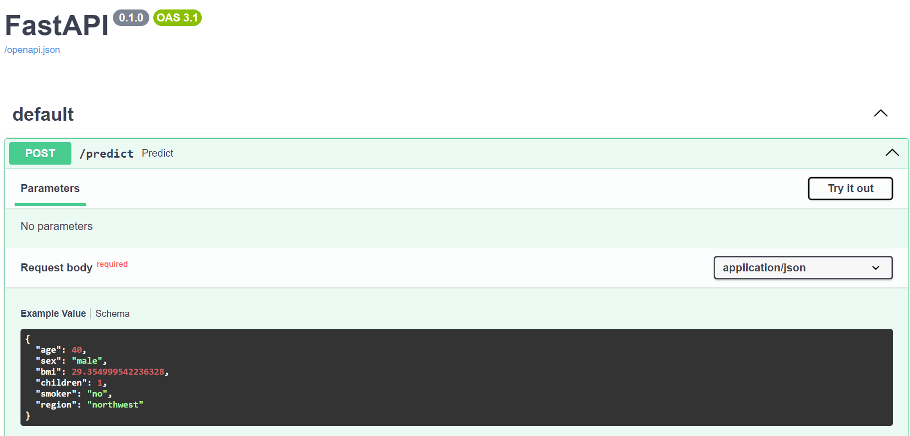

# Demo: deploy ML with API
This demo follows a tutorial to predict the medical charges of patients, utilizing the bulit-in FastAPI support of PyCaret. \
Add `/docs` to the address produced by the script to see the FastAPI documentation and to perform ad-hoc prediciton on new data points. \

# Reference
1. https://www.datacamp.com/tutorial/introduction-fastapi-tutorial
2. https://github.com/pycaret/pycaret/issues/3796
3. https://github.com/pycaret/pycaret/issues/3945